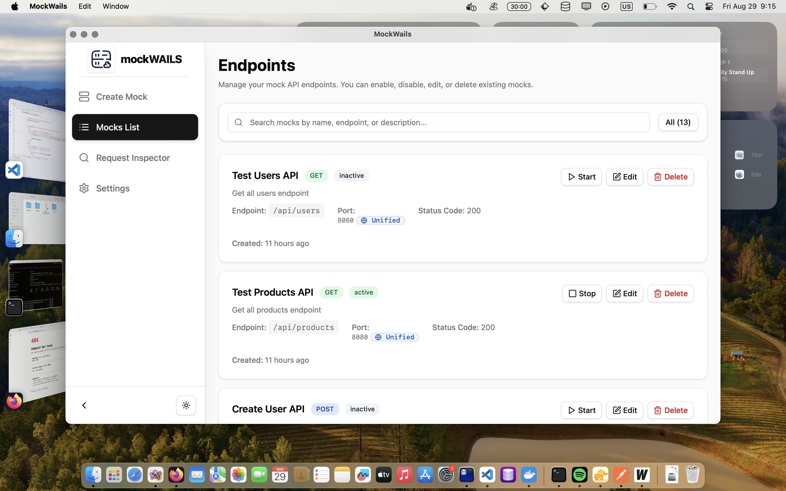
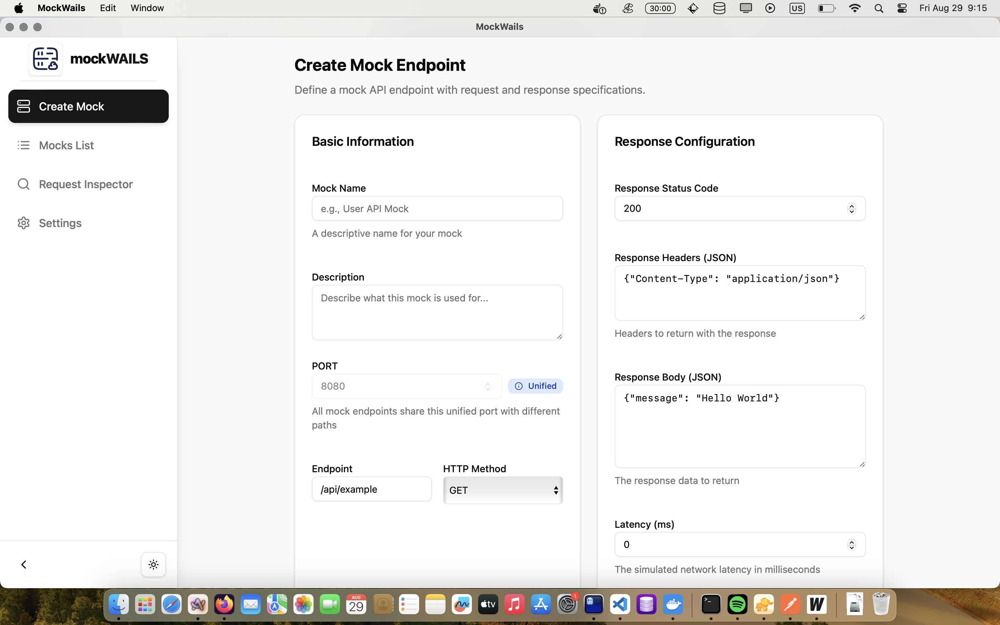
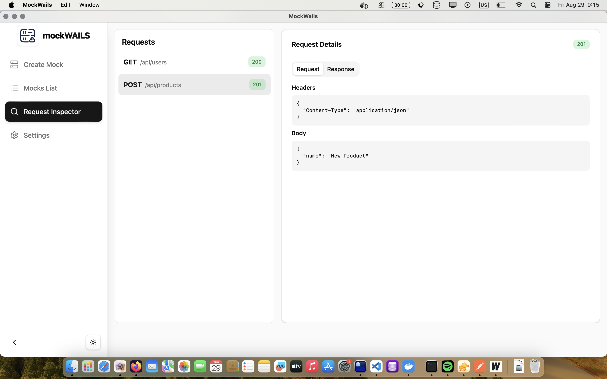
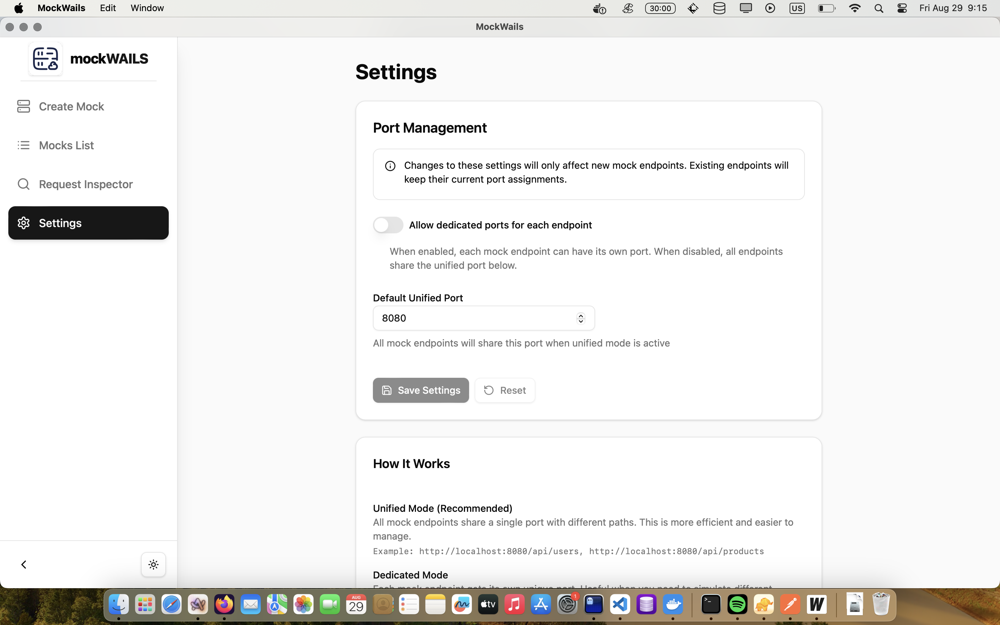

# MockWails

<div align="center">
  
  
  **A powerful desktop application for creating and managing mock HTTP servers**
  
  [](https://golang.org)
  [](https://wails.io)
  [](https://reactjs.org)
  [](https://www.typescriptlang.org)
  [](LICENSE)
</div>

## About

**MockWails** is a comprehensive desktop application designed for developers, testers, and API designers who need to create and manage mock HTTP servers efficiently. Built with modern technologies including **Wails v2**, **Go**, and **React**, it provides a seamless experience for API mocking and testing.

### Why MockWails?

- **🚀 Fast & Lightweight**: Native desktop performance with minimal resource usage
- **🎯 Developer-Friendly**: Intuitive interface designed by developers, for developers
- **⚡ Instant Setup**: Create and deploy mock servers in seconds
- **🔧 Highly Configurable**: Fine-tune every aspect of your mock responses
- **💾 Persistent Storage**: All configurations saved locally with SQLite
- **🔄 Auto-Recovery**: Servers automatically restart when the application launches
- **🌐 Multi-Platform**: Available for Windows, macOS, and Linux

The application allows you to define sophisticated mock servers with specific endpoints, HTTP methods, response statuses, custom headers, and response bodies. All configurations are persisted in a local SQLite database, ensuring your mock setups are preserved across application restarts. Active servers are automatically restarted when the application launches, making it perfect for development workflows.

## ✨ Features

### Core Functionality
- **🏗️ Create and Manage Mock Servers**: Intuitive interface for creating, editing, and deleting mock servers with comprehensive configuration options
- **🎨 Customizable Responses**: Full control over HTTP responses including:
  - Custom endpoints and HTTP methods (GET, POST, PUT, DELETE, PATCH)
  - Configurable status codes (200, 404, 500, etc.)
  - Custom headers and response bodies (JSON, XML, HTML, plain text)
  - Request validation with expected headers and body matching
  - Simulated response latency for realistic testing
- **💾 Persistent Storage**: All mock server configurations are automatically saved to a local SQLite database
- **🔄 Automatic Restart**: Active servers intelligently restart when the application launches, maintaining your development workflow
- **🎯 Easy to Use UI**: Clean, modern, and intuitive user interface with dark/light theme support

### Advanced Features
- **📊 Real-time Status Monitoring**: Live status indicators showing which servers are running
- **🔍 Request Inspection**: Monitor incoming requests to your mock servers
- **⚡ Quick Actions**: Start, stop, edit, and delete servers with single-click actions
- **🔄 Bulk Operations**: Manage multiple servers simultaneously
- **📱 Responsive Design**: Optimized interface that works perfectly on any screen size
- **🎨 Modern UI Components**: Built with Shadcn UI for consistency and accessibility

### Developer Experience
- **🚀 Hot Reload**: Instant updates during development
- **📝 TypeScript Support**: Full type safety across the entire application
- **🧪 Testing Ready**: Perfect for API testing, frontend development, and CI/CD pipelines
- **🔧 Extensible**: Clean architecture for easy customization and extension

## 🖼️ Screenshots

<div align="center">

### Main Interface - Server Management Dashboard
*Overview of all your mock servers with real-time status monitoring*


### Mock Server Creation - Comprehensive Configuration
*Detailed form for creating sophisticated mock endpoints with full customization*


### Server Management - Live Operations
*Real-time server control with start, stop, edit, and delete operations*


### Settings & Configuration - Personalization
*Customize the application behavior and preferences to fit your workflow*


</div>

</br>

## 🚀 Getting Started

### Prerequisites

- **Go 1.21+**: [Download and install Go](https://golang.org/dl/)
- **Node.js 18+**: [Download and install Node.js](https://nodejs.org/)
- **Wails CLI**: Install with `go install github.com/wailsapp/wails/v2/cmd/wails@latest`

### Quick Start

1. **Clone the repository**:
   ```bash
   git clone https://github.com/tacheraSasi/mockwails.git
   cd mockwails
   ```

2. **Install dependencies**:
   ```bash
   make deps
   ```

3. **Run in development mode**:
   ```bash
   make dev
   ```

4. **Build for production**:
   ```bash
   # For your current platform
   wails build
   
   # Or use make commands for specific platforms
   make build-mac      # macOS universal binary
   make build-windows  # Windows 64-bit
   make build-linux    # Linux 64-bit
   ```

### Usage Examples

#### Creating Your First Mock Server

1. **Launch MockWails** and click "Create Mock Endpoint"
2. **Configure your endpoint**:
   - **Name**: "User API"
   - **Endpoint**: "/api/users"
   - **Method**: "GET"
   - **Response**: `{"users": [{"id": 1, "name": "John Doe"}]}`
   - **Status Code**: 200
3. **Click "Create"** - your mock server starts automatically
4. **Test it**: Visit `http://localhost:8080/api/users` in your browser

#### Advanced Configuration

```json
{
  "endpoint": "/api/users",
  "method": "POST",
  "expectedHeaders": {
    "Content-Type": "application/json",
    "Authorization": "Bearer token"
  },
  "expectedBody": {
    "name": "string",
    "email": "string"
  },
  "response": {
    "status": 201,
    "headers": {
      "Content-Type": "application/json"
    },
    "body": {
      "id": 123,
      "message": "User created successfully"
    }
  },
  "latency": 500
}
```

## 🛠️ Tech Stack

### Backend
- **[Go](https://golang.org)**: High-performance backend with excellent concurrency
- **[Wails v2](https://wails.io)**: Modern desktop app framework bridging Go and web technologies
- **[SQLite](https://sqlite.org)**: Embedded database for configuration persistence
- **[GORM](https://gorm.io)**: Elegant ORM for database operations

### Frontend
- **[React 18](https://reactjs.org)**: Modern UI library with hooks and concurrent features
- **[TypeScript](https://www.typescriptlang.org)**: Type safety and enhanced developer experience
- **[Shadcn UI](https://ui.shadcn.com)**: Beautiful, accessible, and customizable components
- **[Tailwind CSS](https://tailwindcss.com)**: Utility-first CSS framework for rapid styling
- **[Vite](https://vitejs.dev)**: Lightning-fast build tool and development server

### Development Tools
- **[Biome](https://biomejs.dev)**: Fast formatter and linter for JavaScript/TypeScript
- **[React Hook Form](https://react-hook-form.com)**: Performant forms with easy validation
- **[Sonner](https://sonner.emilkowal.ski)**: Beautiful toast notifications

## 🔧 Development

### Live Development

For the best development experience with hot reload:

```bash
# Install dependencies (only needed once)
make deps

# Start development server with hot reload
make dev
```

This starts the app with hot reload for both frontend and backend. For frontend-only development in a browser (with access to Go methods), open http://localhost:34115 in your browser.

### Development Workflow

1. **Backend Changes**: Modify Go files - Wails automatically rebuilds and restarts
2. **Frontend Changes**: Edit React/TypeScript files - Vite provides instant hot reload
3. **Database Changes**: Update models in `db/` - restart required for schema changes
4. **UI Components**: Modify components in `frontend/src/components/` - see changes instantly

### Project Structure

```
mockwails/
├── app.go              # Main application logic and Wails bindings
├── main.go             # Application entry point
├── wails.json          # Wails configuration
├── config/             # Application configuration
│   └── config.go
├── db/                 # Database models and operations
│   ├── db.go           # Database initialization
│   ├── server.go       # Server model definitions
│   ├── server_ops.go   # Server CRUD operations
│   └── migrate.go      # Database migrations
├── mockserver/         # HTTP server implementation
│   ├── server.go       # Mock server logic
│   └── templates.go    # HTML templates for 404 pages
├── utils/              # Utility functions
│   └── utils.go
├── frontend/           # React frontend
│   ├── src/
│   │   ├── components/ # Reusable UI components
│   │   ├── pages/      # Application pages
│   │   ├── contexts/   # React contexts
│   │   └── lib/        # Utility functions
│   └── wailsjs/        # Generated Wails bindings
└── build/              # Build outputs and assets
```

## 📦 Building

### Production Builds

To build a redistributable, production-ready package:

```bash
# Build for your current platform
wails build

# Or use platform-specific make commands
make build-windows    # Windows 64-bit (.exe)
make build-linux      # Linux 64-bit (AppImage)
make build-mac        # macOS universal binary (.app)
```

### Build Outputs

- **Windows**: `build/bin/MockWails.exe`
- **macOS**: `build/bin/MockWails.app`
- **Linux**: `build/bin/MockWails` (executable)

### Distribution

The built applications are self-contained and don't require any additional dependencies. They can be distributed directly to end users.

## 🛠️ Makefile Commands

The project includes a comprehensive `Makefile` to simplify common development tasks. Run `make help` to see all available commands:

### Development Commands
- `make dev` - Run the application in development mode with hot reloading
- `make deps` - Install frontend dependencies from `package.json`
- `make clean` - Clean build artifacts and temporary files

### Build Commands
- `make build-windows` - Build the application for Windows (64-bit)
- `make build-linux` - Build the application for Linux (64-bit)
- `make build-mac` - Build the application for macOS (universal binary)

### Code Quality Commands
- `make lint` - Lint the frontend code using Biome
- `make format` - Format the frontend code using Biome
- `make check` - Check and apply automatic fixes to the frontend code using Biome

### Database Commands
- `make db-reset` - Reset the database (removes all data)
- `make db-migrate` - Run database migrations

### Example Workflow
```bash
# Setup project
make deps

# Start development
make dev

# Before committing
make check
make lint

# Build for production
make build-mac
```